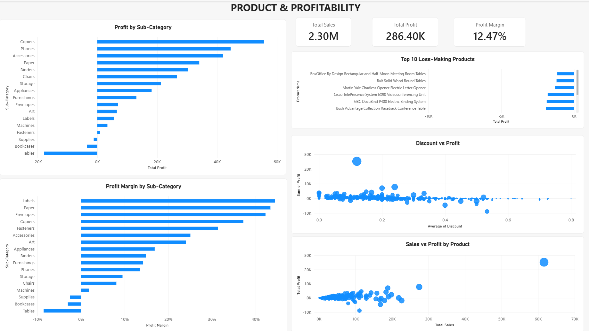

# Superstore Sales & Profitability Analysis

An end-to-end data analytics project analyzing retail sales, profitability, customers, products, discounts, regions, and shipping performance using Python, SQL/MySQL, and Power BI.

## Project Overview

This project uses the Sample Superstore dataset to identify sales and profitability patterns and turn the analysis into business-focused insights.

The project follows a complete analytics workflow:

**Data Cleaning → Exploratory Data Analysis → SQL Analysis → Power BI Dashboard**

## Business Questions

The analysis focuses on questions such as:

- What are the overall sales, profit, orders, and profit margin?
- Which product categories and sub-categories are most profitable?
- Which products are generating losses?
- How does discount level relate to profitability?
- Which regions generate the most sales and profit?
- Which customers contribute the most sales and profit?
- How does sales and profit change over time?
- How does shipping mode affect delivery time and profitability?

## Tools & Technologies

- **Python**
  - Pandas
  - NumPy
  - Matplotlib
  - Jupyter Notebook

- **SQL**
  - MySQL
  - Data aggregation
  - GROUP BY
  - CASE statements
  - Date functions
  - Business analysis queries

- **Power BI**
  - Data modeling
  - DAX measures
  - KPI cards
  - Interactive slicers
  - Charts and visualizations
  - Profitability analysis

## Dataset

The project uses the **Sample Superstore** dataset containing retail order, customer, product, sales, discount, and profit information.

The dataset contains **9,994 records**.

## Data Cleaning & Preparation

Python was used for initial data preparation and exploratory analysis.

Key steps included:

- Loaded the CSV dataset using Pandas
- Converted Order Date and Ship Date into datetime format
- Checked for duplicate records
- Created Delivery Days
- Created Year and Month fields
- Created Profit Margin %
- Created Profit/Loss Status
- Created Discount Band
- Performed category and sub-category analysis
- Investigated discount and profitability relationships
- Exported the cleaned dataset for Power BI

## SQL Analysis

The cleaned Superstore data was imported into MySQL for structured analysis.

SQL analysis includes:

- Overall sales and profitability
- Category performance
- Sub-category profitability
- Loss-making sub-categories
- Discount vs. profit analysis
- Regional performance
- Top customers by sales
- Top customers by profit
- Top loss-making products
- Regional and category analysis
- Discount band analysis
- Yearly performance
- Monthly sales and profit trends
- Shipping performance

The complete SQL queries are available in:

`superstore_analysis.sql`

## Power BI Dashboard

The Power BI dashboard contains three analytical pages.

### 1. Executive Overview

Includes:

- Total Sales
- Total Profit
- Total Orders
- Profit Margin
- Monthly Sales & Profit Trend
- Profit by Category
- Profit by Region
- Year, Region, and Category filters

### 2. Product & Profitability

Includes:

- Sales and Profit KPIs
- Profit by Sub-Category
- Discount vs. Profit analysis
- Top 10 Loss-Making Products
- Sales vs. Profit by Product
- Profit Margin by Sub-Category

### 3. Customer & Regional Analysis

Includes:

- Sales by Customer Segment
- Top 10 Customers by Sales
- Sales by State
- Profit by Ship Mode
- Top 10 Customers by Profit
- Year and Region filters

## Key Findings

Some of the main findings from the analysis include:

- Total sales are approximately **$2.30M**.
- Total profit is approximately **$286.40K**.
- Overall profit margin is approximately **12.47%**.
- Technology generated the highest total profit among the three main categories.
- Furniture had substantially lower profitability than Technology and Office Supplies.
- Tables and Bookcases were among the loss-making sub-categories.
- Higher discount levels were associated with lower average profitability in the dataset.
- A small group of loss-making products contributed significantly to the overall losses in the Tables sub-category.
- Regional and product-level analysis revealed differences in profitability despite similar sales levels.

> These findings describe patterns observed in the dataset and do not by themselves establish causal relationships.

## Dashboard Preview

### Executive Overview


### Product & Profitability



### Customer & Regional Analysis


## Project Structure

```text
superstore-sales-profitability-analysis/
│
├── Superstore_Cleaned.csv
├── superstore_data_analysis.ipynb
├── superstore_analysis.sql
├── Superstore_Dashboard.pbix
├── README.md
├── LICENSE
└── .gitignore


