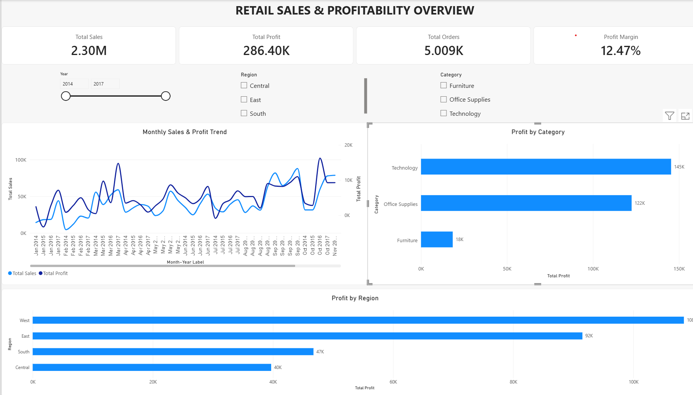

# Superstore Sales & Profitability Analysis

An end-to-end retail sales and profitability analysis project using Python, Pandas, MySQL, SQL, and Power BI.

## Project Overview

This project analyzes the Sample Superstore dataset to identify patterns in sales, profitability, customers, products, discounts, regions, and shipping performance.

The project follows a complete analytics workflow:

**Data Cleaning → Exploratory Data Analysis → SQL Analysis → Power BI Dashboard**

## Business Questions

- What are the overall sales, profit, orders, and profit margin?
- Which categories and sub-categories are most profitable?
- Which products are generating losses?
- How does discount level relate to profitability?
- Which regions generate the most sales and profit?
- Which customers contribute the most sales and profit?
- How do sales and profit change over time?
- How does shipping mode relate to delivery time and profitability?

## Tools & Technologies

- **Python:** Pandas, NumPy, Matplotlib, Jupyter Notebook
- **SQL:** MySQL
- **Power BI:** DAX, KPI cards, interactive filters, data visualization

## Dataset

The project uses the Sample Superstore retail dataset containing **9,994 records** with information about:

- Orders
- Customers
- Products
- Categories
- Sales
- Quantity
- Discounts
- Profit
- Regions
- Shipping

## Data Cleaning & Preparation

Python and Pandas were used to prepare and analyze the dataset.

Key steps included:

- Loaded the CSV dataset using Pandas
- Converted Order Date and Ship Date into datetime format
- Checked for duplicate records
- Created Delivery Days
- Created Year and Month fields
- Created Profit Margin %
- Created Profit/Loss Status
- Created Discount Band
- Performed category and sub-category analysis
- Analyzed discounts and profitability
- Exported the cleaned dataset for Power BI

## SQL Analysis

The dataset was imported into MySQL for structured business analysis.

SQL analysis includes:

- Overall sales and profitability
- Category performance
- Sub-category profitability
- Loss-making sub-categories
- Discount vs. profit analysis
- Regional performance
- Top customers by sales
- Top customers by profit
- Top loss-making products
- Regional and category analysis
- Discount band analysis
- Yearly performance
- Monthly sales and profit trends
- Shipping performance

The complete SQL queries are available in:

`superstore_analysis.sql`

## Power BI Dashboard

The Power BI dashboard contains three analytical pages.

### 1. Executive Overview

- Total Sales
- Total Profit
- Total Orders
- Profit Margin
- Monthly Sales & Profit Trend
- Profit by Category
- Profit by Region
- Year, Region, and Category filters

### 2. Product & Profitability

- Sales and Profit KPIs
- Profit by Sub-Category
- Discount vs. Profit
- Top 10 Loss-Making Products
- Sales vs. Profit by Product
- Profit Margin by Sub-Category

### 3. Customer & Regional Analysis

- Sales by Customer Segment
- Top 10 Customers by Sales
- Sales by State
- Profit by Ship Mode
- Top 10 Customers by Profit
- Year and Region filters

## Dashboard Preview

### Executive Overview



### Product & Profitability


### Customer & Regional Analysis


## Key Findings

- Total sales are approximately **$2.30M**.
- Total profit is approximately **$286.40K**.
- Overall profit margin is approximately **12.47%**.
- Technology generated the highest total profit among the three main categories.
- Furniture had substantially lower profitability than Technology and Office Supplies.
- Tables and Bookcases were among the loss-making sub-categories.
- Higher discount levels were associated with lower average profitability in the dataset.
- A small group of loss-making products contributed significantly to losses in the Tables sub-category.
- Regional and product-level analysis revealed differences in profitability across the business.

> These findings describe patterns observed in the dataset and do not by themselves establish causal relationships.

## Project Structure

```text
superstore-sales-profitability-analysis/
│
├── screenshots/
│   ├── executive_overview.png
│   ├── product_profitability.png
│   └── Customer & Regional Analysis.png
│
├── Superstore_Cleaned.csv
├── superstore_data_analysis.ipynb
├── superstore_analysis.sql
├── Superstore_Dashboard.pbix
├── README.md
├── LICENSE
└── .gitignore
